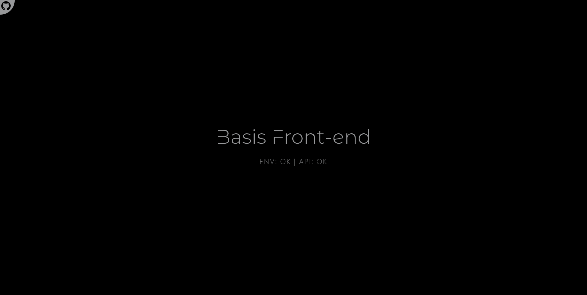
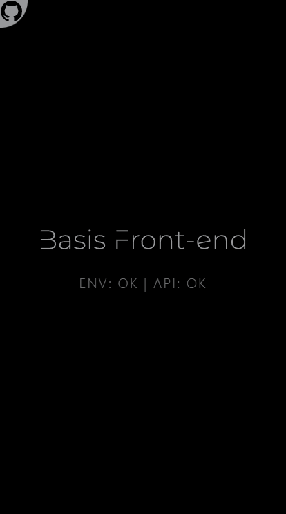

<div align="center">
  <a href="https://basis-frontend.sebastianlacoste.com" target="_blank" rel="noopener noreferrer">
    
  </a>
</div>

---

> [Basis Front-end](https://basis-frontend.sebastianlacoste.com), for a quick start in development with Vite, React, Tailwind CSS, Axios, and Much more.

## Features

- **Pre-Config**

  - **Vite**

    - Environment Variables

  - **React & React Router**

    - Project Structure

    - Context & Hooks

    - Browser Router

  - **Tailwind CSS**

    - index.css

    - Custom Colors

  - **PostCSS**

  - **Axios**

    - Custom Instance

      - BaseURL ([CoinGecko API](https://www.coingecko.com/en/api))

    - REQ

      - GET

  - **PWA Support**

    - manifest.json

    - Service Worker

  - **Netlify**

    - \_redirects

- **Mobile-Friendly**

- **README Template**

## Tech Stack

- **Front-end**

  - **Build**

    - [Vite](https://github.com/vitejs/vite)

  - **HTML/JS**

    - [React](https://github.com/facebook/react)

    - [React Router](https://github.com/remix-run/react-router)

  - **CSS**

    - [Tailwind CSS](https://github.com/tailwindlabs/tailwindcss)

    - [Prettier plugin for Tailwind CSS](https://github.com/tailwindlabs/prettier-plugin-tailwindcss)

    - [PostCSS](https://github.com/postcss/postcss)

    - [Autoprefixer](https://github.com/postcss/autoprefixer)

  - **HTTP-Client**

    - [Axios](https://github.com/axios/axios)

## Environment Variables

Before running it locally, you must obtain the following values to initialize the required variables.

| Variable           | Value     | Description                   |
| :----------------- | :-------- | :---------------------------- |
| `VITE_ENV_CONTENT` | `testing` | **Not/Required**. ENV Testing |

## Run Locally

Install required

- [Node.js/npm](https://nodejs.org/en/download)

Clone the repository

- HTTPS

  ```bash
  git clone https://github.com/sebastianlacoste/basis-frontend.git
  ```

- SSH

  ```bash
  git clone git@github.com:sebastianlacoste/basis-frontend.git
  ```

Go to the repository directory

```bash
  cd basis-frontend/
```

Install dev/Dependencies

```bash
  npm i
```

Add Environment Variables to `.env` file

- You must replace **"somevalue"** with your own values.

```bash
  echo $'VITE_ENV_CONTENT=somevalue' >> .env
```

Start the server

```bash
  npm run dev
```

In the browser, go to

```
  http://localhost:3000
```

**All-In-One**

- HTTPS

  ```bash
  git clone https://github.com/sebastianlacoste/basis-frontend.git; cd basis-frontend/; npm i; echo $'VITE_ENV_CONTENT=somevalue' >> .env; npm run dev;
  ```

- SSH

  ```bash
  git clone git@github.com:sebastianlacoste/basis-frontend.git; cd basis-frontend/; npm i; echo $'VITE_ENV_CONTENT=somevalue' >> .env; npm run dev;
  ```

## Screenshots

- **Desktop**

  

- **Mobile**

  

## License

- [MIT](./LICENSE)
