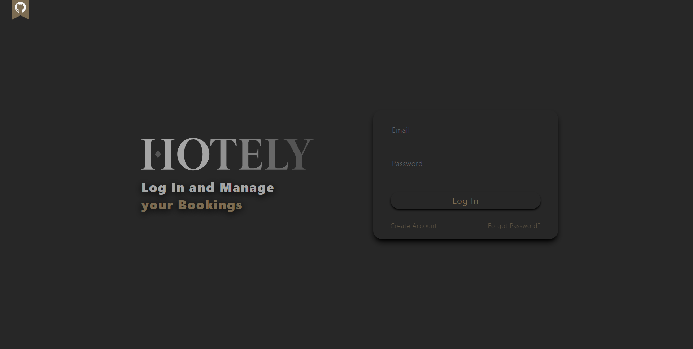
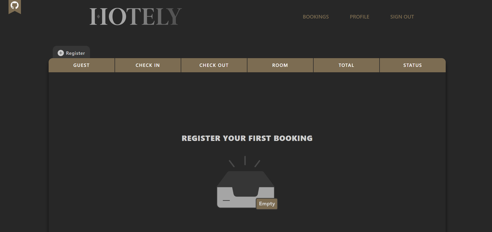

<div align="center">
  <a href="https://hotely.sebastianlacoste.com" target="_blank" rel="noopener noreferrer">
    
  </a>
</div>

---

> [Hotely](https://hotely.sebastianlacoste.com) is a Booking Manager Client that interacts with the API running on [Hotely-Server](https://github.com/sebastianlacoste/hotely-server).

## Features

- **Pages Layout**

  - **Public**

    - Register

    - Email Confirm

    - Login

    - Forgot Password

    - Password Reset

    - Terms

  - **Private**

    - Bookings Manager

    - Hotel Profile

- **Manager**

  - **Hotel Profile**

    - Create, Read and Update

  - **Bookings**

    - Create, Read, Update and Delete

    - CheckIn and CheckOut Status

      - Pending

      - Active

      - Finished

- **Mobile-Friendly**

- **PWA Support**

## Tech Stack

- **Build**

  - [Vite](https://github.com/vitejs/vite)

- **HTML/JS**

  - [React](https://github.com/facebook/react)

  - [React Router](https://github.com/remix-run/react-router)

- **CSS**

  - [Tailwind CSS](https://github.com/tailwindlabs/tailwindcss)

  - [Prettier plugin for Tailwind CSS](https://github.com/tailwindlabs/prettier-plugin-tailwindcss)

  - [PostCSS](https://github.com/postcss/postcss)

  - [Autoprefixer](https://github.com/postcss/autoprefixer)

- **HTTP-Client**

  - [Axios](https://github.com/axios/axios)

## Environment Variables

Before running it locally, you must obtain the following values to initialize the required variables.

| Variable          | Value                                                              | Description                                  |
| :---------------- | :----------------------------------------------------------------- | :------------------------------------------- |
| `VITE_SERVER_URL` | [Hotely-Server](https://github.com/sebastianlacoste/hotely-server) | **Required**. API basePath URL on the Server |

## Run Locally

Install required

- [Node.js/npm](https://nodejs.org/en/download)

Clone the repository

- HTTPS

  ```bash
  git clone https://github.com/sebastianlacoste/hotely-client.git
  ```

- SSH

  ```bash
  git clone git@github.com:sebastianlacoste/hotely-client.git
  ```

Go to the repository directory

```bash
  cd hotely-client/
```

Install dev/Dependencies

```bash
  npm i
```

Add Environment Variables to `.env` file

- You must replace **"somevalue"** with your own values.

```bash
  echo $'VITE_SERVER_URL=somevalue' >> .env
```

Start the server

```bash
  npm run dev
```

In the browser, go to

```
  http://localhost:3000
```

**All-In-One**

- HTTPS

  ```bash
  git clone https://github.com/sebastianlacoste/hotely-client.git; cd hotely-client/; npm i; echo $'VITE_SERVER_URL=somevalue' >> .env; npm run dev;
  ```

- SSH

  ```bash
  git clone git@github.com:sebastianlacoste/hotely-client.git; cd hotely-client/; npm i; echo $'VITE_SERVER_URL=somevalue' >> .env; npm run dev;
  ```

## Screenshots

- **Desktop**

  

  

- **Mobile**

  

  

  

## License

- [MIT](./LICENSE)
